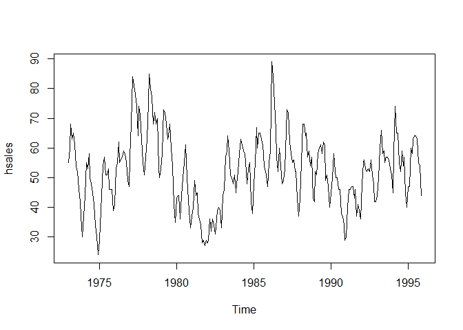
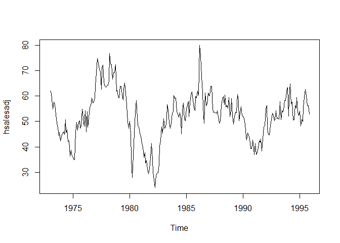
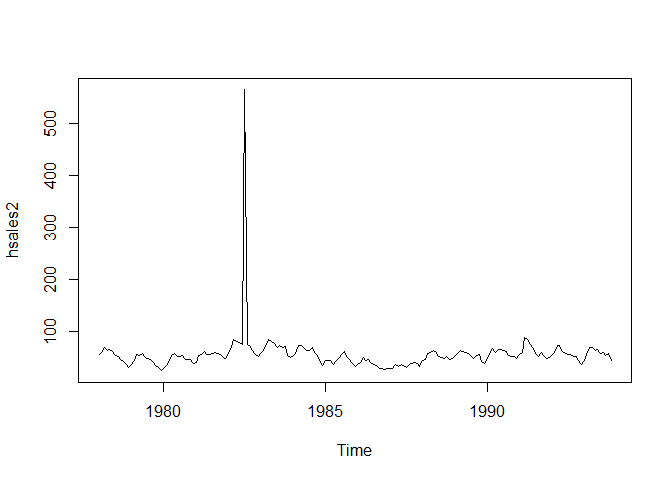
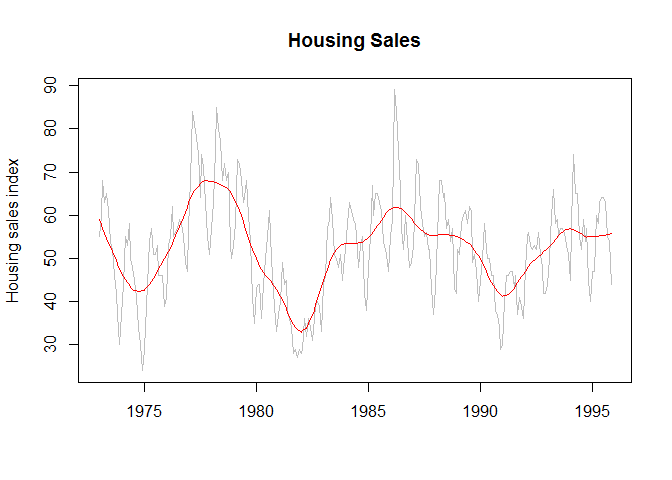

# Hsales
Sharon Teo  
July 16, 2016  
#Library required

```r
library(fpp)
```

#Plot the time series. Can you identify seasonal fluctuations and/or a trend? 
###The data shows a strong seasonal fluctuation for a yearly time period. There is no apparent upward or downward trend

```r
data(hsales)
plot(hsales)
```

<!-- -->

#Use a classical decomposition to calculate the trend-cycle and seasonal indices.
#Do the results support the graphical interpretation from part (a)? 
###Yes the results support the graphical interpretation from part (a). The yearly seasonal fluctuation is shown very clearly on the seasonal plot. Also the trend plot shows no increasing or decreasing trend

```r
fitd <- decompose(hsales)
plot(fitd)
```

<!-- -->

#Compute and plot the seasonally adjusted data

```r
hsalesadj <- seasadj(fitd)
plot(hsalesadj)
```

<!-- -->

#Change one observation to be an outlier (e.g., add 500 to one observation), and recompute the seasonally adjusted data. What is the effect of the outlier? 

### The outlier causes a spike in the graph

```r
hsales2 <- ts(c(hsales[1:54],hsales[55]+500,hsales[56:191]),start=c(1978,1),frequency=12)
plot(hsales2)
```

<!-- -->

#Does it make any difference if the outlier is near the end rather than in the middle of the time series? 
### No

#Use STL to decompose the series

```r
fit <- stl(hsales, s.window=5)
plot(fit)
```

<!-- -->

```r
plot(hsales, col="gray",
  main="Housing Sales",
  ylab="Housing sales index", xlab="")
lines(fit$time.series[,2],col="red",ylab="Trend")
```

<!-- -->
